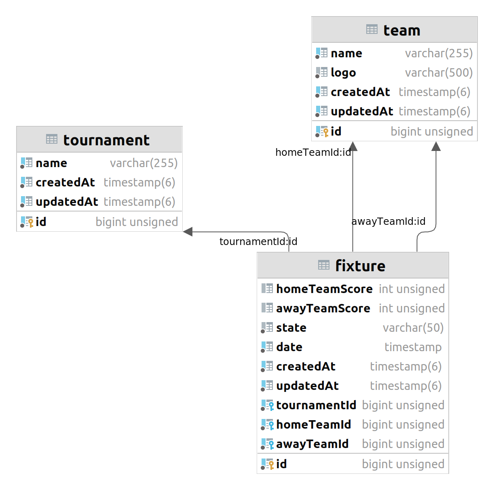

## Installation

#### Install Docker
https://docs.docker.com/engine/install/ubuntu/

#### Install Docker Compose
https://docs.docker.com/compose/install/other/

#### Install Makefile
```bash
sudo apt install make
```


## Running the app

```bash
# Install npm packages 
$ make npm_install

# Startup 
$ make startup

# Run migration
$ make migrate

# Import test data
$ make seed
```

## API documentation
dev: http://localhost:5000/api/v1/docs

live: http://128.199.138.114:5000/api/v1/docs

## Test

```bash
# unit tests & integration tests 
$ make run_test
```

## DB Design


## Decisions
1. [0001-fixture-pagination](doc/decisions/0001-fixture-pagination.md)
2. [0002-dto-and-swagger](doc/decisions/0002-dto-and-swagger.md)
